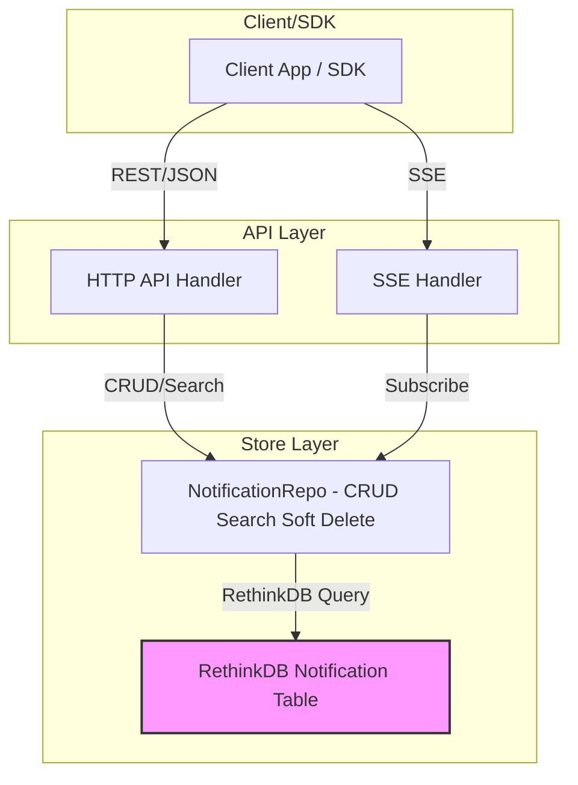
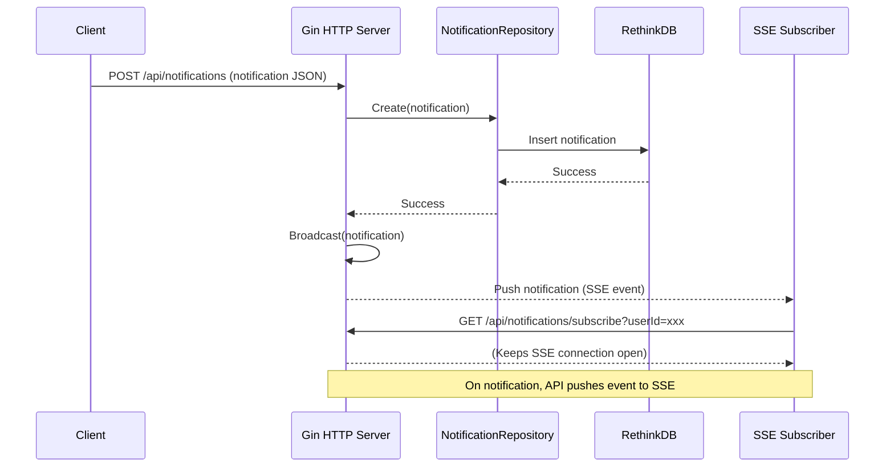

# Notification Service

A robust notification service that follows the specifications outlined in `spec.md` and `notification_openapi_spec.yaml`.

## Features

- **Complete Notification Object Structure**: Includes all required and optional fields as specified.
- **Comprehensive API Endpoints**:
  - Create notifications (`POST /api/notifications`)
  - List notifications (`GET /api/notifications?userId=xxx`)
  - Mark notifications as read (`POST /api/notifications/:id/read`)
  - Delete notifications (`DELETE /api/notifications/:id`)
  - Search notifications (`POST /api/notifications/search`)
  - Subscribe to notification updates (`GET /api/notifications/subscribe?userId=xxx`)
- **Advanced Filtering and Sorting**:
  - Filter by read status, priority, labels, groupId, and timestamp
  - Sort by timestamp, priority, read status, and groupId
- **Auto-Expiry**: Automatically removes expired notifications
- **Real-time Updates**: Delivers notifications in real-time via Server-Sent Events (SSE)
- **Robust Error Handling**: Comprehensive error handling throughout the codebase
- **Graceful Shutdown**: Proper cleanup of resources during application shutdown

## Architecture

The notification service is built with a clean architecture approach:

- **API Layer**: Handles HTTP requests and responses
- **Store Layer**: Manages data persistence using RethinkDB

## Prerequisites

- Go 1.16 or higher
- RethinkDB 2.4 or higher

## Installation

1. Clone the repository:
   ```bash
   git clone https://github.com/yourusername/notification-service.git
   cd notification-service
   ```

2. Install dependencies:
   ```bash
   go mod tidy
   ```

3. Start RethinkDB:
   ```bash
   # Using Docker
   docker run -d -p 28015:28015 -p 3000:3000 --name rethinkdb rethinkdb:2.4
   ```

## Running the Service

### Using Make

The project includes a Makefile to simplify common tasks:

```bash
# Build the application
make build

# Run the application
make run

# Run tests
make test

# Generate test coverage report
make coverage

# Start with Docker Compose
make docker-run

# Stop Docker Compose services
make docker-stop

# Show all available commands
make help
```

### Locally

```bash
go run main.go
```

The service will start on port 8081 by default.

### Using Docker

The service can be run using Docker and Docker Compose:

```bash
# Build and start the service with RethinkDB
docker-compose up -d

# View logs
docker-compose logs -f

# Stop the service
docker-compose down
```

### Environment Variables

The service can be configured using the following environment variables:

- `RETHINKDB_ADDR`: RethinkDB connection address (default: `localhost:28015`)
- `DB_NAME`: RethinkDB database name (default: `notifdb`)

## API Usage

### Create a Notification

```bash
curl -X POST http://localhost:3000/api/notifications \
  -H "Content-Type: application/json" \
  -d '{
    "title": "New Message",
    "message": "You have a new message from John",
    "priority": "normal",
    "read": false,
    "recipients": [
      {
        "type": "user",
        "id": "user123"
      }
    ],
    "labels": ["message", "chat"],
    "appName": "Chat App",
    "groupId": "chat:user123"
  }'
```

### Get Notifications for a User

```bash
curl -X GET http://localhost:3000/api/notifications?userId=user123
```

### Mark a Notification as Read

```bash
curl -X POST http://localhost:3000/api/notifications/RETHINKDB_ID/read
```

### Delete a Notification

```bash
curl -X DELETE http://localhost:3000/api/notifications/RETHINKDB_ID
```

### Search Notifications

```bash
curl -X POST http://localhost:3000/api/notifications/search \
  -H "Content-Type: application/json" \
  -d '{
    "keyword": "message",
    "userId": "user123"
  }'
```

### Subscribe to Notification Updates

```bash
curl -X GET http://localhost:3000/api/notifications/subscribe?userId=user123
```

## Running Tests

The project includes comprehensive unit and integration tests for all components. To run the tests:

```bash
./run_tests.sh
```

This script will:
1. Update dependencies
2. Run all tests with race detection and generate a coverage profile
3. Generate an HTML coverage report
4. Run specific tests for each package

## Architecture Diagram



## End-to-End Notification Flow

The following sequence diagram illustrates the e2e flow for notification creation and real-time delivery via SSE:



**Legend:**
- **Client/SDK**: End-user applications or the provided Go SDK.
- **API Layer**: HTTP endpoints for CRUD, search, and SSE subscription.
- **Store Layer**: Data access logic, including soft delete and search.
- **RethinkDB**: Persistent storage for notifications.

## Code Structure

- `api/`: HTTP handlers and API endpoints
- `store/`: Data persistence layer with RethinkDB
- `sdk/`: Client SDK for interacting with the notification service
- `main.go`: Application entry point

## Client SDK

The notification service includes a Go client SDK that makes it easy to interact with the API. See the [SDK README](sdk/README.md) for detailed usage instructions.

### Basic SDK Usage

```go
import (
    "context"
    "notification/sdk"
    "time"
)

// Create a client
client := sdk.NewClient("http://localhost:3000")

// Send a notification
notification := types.Notification{
    Title:     "Test Notification",
    Message:   "This is a test notification",
    Priority:  "normal",
    Recipients: []types.Recipient{
        {Type: "user", ID: "user123"},
    },
}
err := client.SendNotification(context.Background(), notification)

// Get notifications for a user
notifications, err := client.GetNotifications(context.Background(), "user123")

// Subscribe to real-time updates
eventCh, err := client.SubscribeToNotifications(context.Background(), "user123")
for event := range eventCh {
    if event.Error != nil {
        // Handle error
        continue
    }
    // Process notification
    fmt.Printf("Received: %s\n", event.Notification.Title)
}
```

## License

MIT
